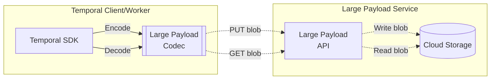
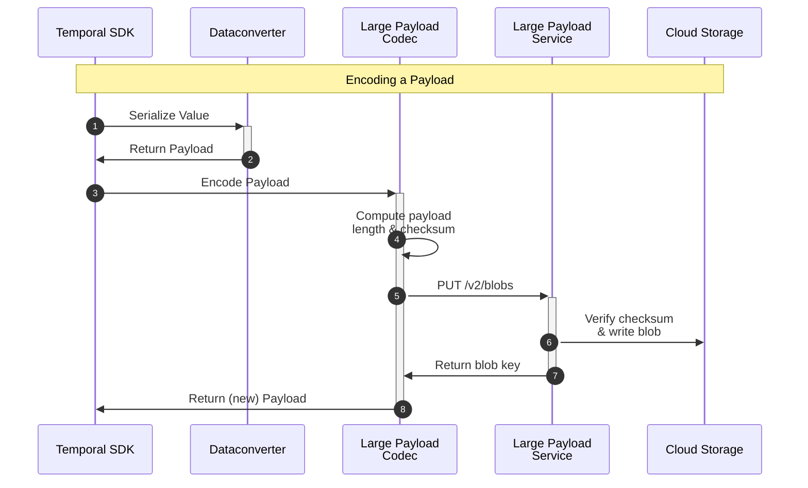
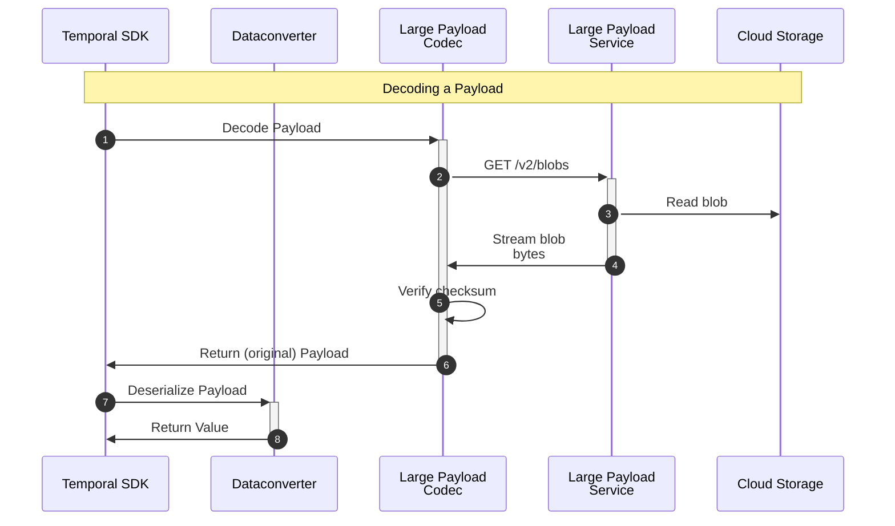

# Large Payload Service

> ⚠️ This repository has been open sourced in order to help further discussion in the Temporal community about a proposal for official Temporal large payloads support.
>
> We welcome experimentation and feedback, but please do not use in production. We make no guarantees about backwards compatibility of codecs, the HTTP interface, or storage drivers. If and when the upstream Temporal project includes support for large payloads, this repository will not be maintained.

This repository contains a HTTP service and accompanying Temporal [Payload Codec](https://docs.temporal.io/security#payload-codec) which allows Temporal clients to automatically persist large payloads outside of workflow histories.

Temporal limits payload size to 4MB.
The Large Payload Codec allows Temporal clients to read and write payloads larger than this limit by transparently storing and retrieving them via an HTTP service backed by cloud storage. In essence, the Large Payload Service implements a [content addressed storage](https://en.wikipedia.org/wiki/Content-addressable_storage) (CAS) interface for Temporal payloads.

For more details on the motivation, see the talk "Temporal at Datadog" from Replay 2022: https://youtu.be/LxgkAoTSI8Q?t=1686

<!-- toc -->

- [Usage](#usage)
- [Architecture](#architecture)
  * [Example Conversion](#example-conversion)
  * [Sequence Diagram for Payload Encoding](#sequence-diagram-for-payload-encoding)
  * [Sequence Diagram for Payload Decoding](#sequence-diagram-for-payload-decoding)
- [API](#api)
- [Development](#development)

<!-- tocstop -->

## Usage

This repository does not provide any prebuilt binaries or images.
The recommended approach is to build your own binary and image.

To programmatically build the Large Payload Service, you need to instantiate the driver and then pass it to `server.NewHttpHandler`.
For example, to create a Large Payload Service instance backed by an S3 bucket, you would do something along these lines:

```golang
package main

import (
    "context"
    "net/http"
    "os"

    "github.com/aws/aws-sdk-go-v2/config"
    "github.com/DataDog/temporal-large-payload-codec/server"
    "github.com/DataDog/temporal-large-payload-codec/server/storage/s3"
    ...
)

func main() {
    region, set := os.LookupEnv("AWS_SDK_REGION")
    if !set {
        log.Fatal("AWS_REGION environment variable not set")
    }
    bucket, set := os.LookupEnv("BUCKET")
    if !set {
        log.Fatal("BUCKET environment variable not set")
    }

    cfg, err := config.LoadDefaultConfig(context.Background(), config.WithRegion(region))
    if err != nil {
        log.Fatal(err)
    }

    driver := s3.New(&s3.Config{
      Config: cfg,
      Bucket: bucket,
    })

    mux := http.NewServeMux()
    mux.Handle("/", server.NewHttpHandler(driver)))

    if err := http.ListenAndServe(":8577", mux); err != nil {
      log.Fatal(err)
    }
}
```

On the Temporal side, you need to create the Large Payload Server `PayloadCodec`, wrap it in a `CodecDataConverter` and pass it to the Temporal client contructor (simplified, without error handling):

```golang
opts := client.Options{
...
}

lpsEndpoint, _ := os.LookupEnv("LARGE_PAYLOAD_SERVICE_URL");
lpc, _ := largepayloadcodec.New(largepayloadcodec.WithURL(lpsEndpoint))
opts.DataConverter = converter.NewCodecDataConverter(opts.DataConverter, lpc)

temporalClient, _ := router.NewClient(opts)
```

## Architecture

Architecturally, large payloads are passed through the `CodecDataConverter` which in turn uses the large payload codec to en- and decode the payloads.
If the payload size is larger than the configured maximum payload size (default 128KB), the codec will use the Large Payload API to PUT or GET the payload from the Large Payload Service.



### Example Conversion

Given a large input payload where _data_ is larger than 128KB:

```json
{
  "metadata": {
    "encoding": "text/plain"
  },
  "data": "..."
}
```

The large payload codec will encode this payload as follows:

```json
{
  "metadata": {
    "encoding": "json/plain",
    "temporal.io/remote-codec": "v2"
  },
  "data": {
    "metadata": {"encoding": "text/plain"},
    "size": 1234567,
    "digest": "sha256:deadbeef",
    "key": "/blobs/default/sha256:deadbeef"
  }
}
```

- _metadata_: Original payload's metadata + `temporal.io/remote-codec` metadata header to indicate the use of the remote codec
- _size_: Size in bytes of _data_ field in original payload
- _digest_: Digest of _data_ in original payload (for integrity checks)
- _key_: Key used by the codec retrieve the stored payload

### Sequence Diagram for Payload Encoding



### Sequence Diagram for Payload Decoding



## API

The Large Payload Service offers the following API:

- `/v2/health/head`: Health check endpoint using a `HEAD` request.

  Returns the HTTP response status code 200 if the service is running correctly.
  Otherwise, an error code is returned.

- `/v2/blobs/put`: Upload endpoint expecting a `PUT` request.

  **Required headers**:
    - `Content-Type` set to `application/octet-stream`.
    - `Content-Length` set to the length of payload the data in bytes.
    - `X-Temporal-Metadata` set to the base64 encoded JSON of the Temporal Metadata.

  **Query parameters**:
    - `namespace` The Temporal namespace the client using the codec is connected to.

      The namespace forms part of the key for retrieval of the payload.
    - `digest` Specifies the checksum over the payload data using the format `sha256:<sha256_hex_encoded_value>`.

  The returned _key_ of the put request needs to be stored and used for later retrieval of the payload.
  It is up to the Large Payload Server and the backend driver how to arrange the data in the backing data store.
  The server will honor, however, the value of `remote-codec/key-prefix` in the Temporal Metadata passed via the `X-Temporal-Metadata` header.
  It will use the specified string as prefix in the storage path.

- `/v2/blobs/get`: Download endpoint expecting a `GET` request.

  **Required headers**:
    - `Content-Type` set to `application/octet-stream`.
    - `X-Payload-Expected-Content-Length` set to the expected size of the payload data in bytes.

  **Query parameters**:
    - `key` specifying the key for the payload to retrieve.

## Development

Refer to [CONTRIBUTING.md](./CONTRIBUTING.md) for instructions on how to build and test the Large Payload Service and for general contributing guidelines.
